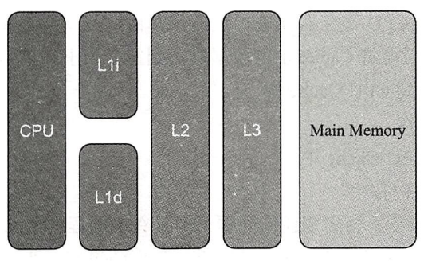
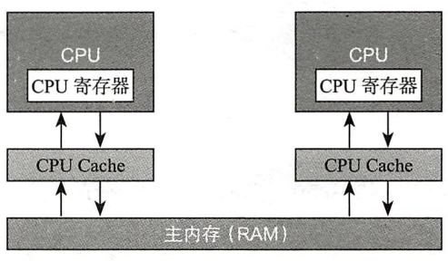
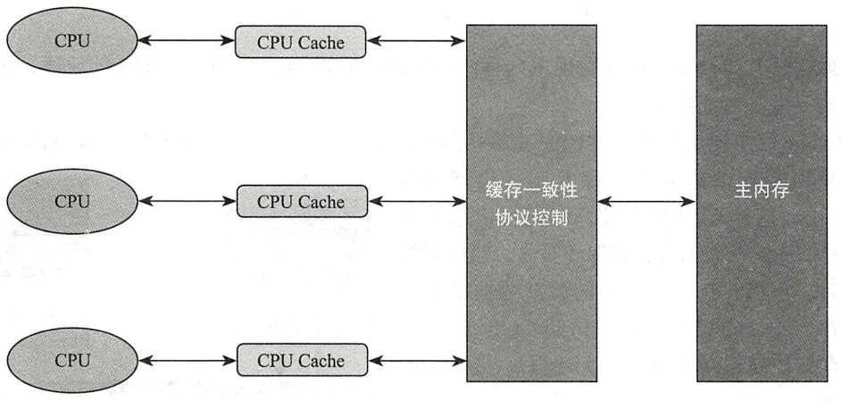
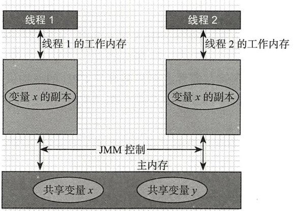

## volatile

```java
public class VolatileDemo {
    final static int MAX = 5;
    static volatile int init_value = 0;

    public static void main(String[] args) {
        new Thread(()-> {
            int localValue = init_value;
            while(localValue <= MAX) {
                if(init_value != localValue) {
                    System.out.printf("The init_value is updated to [%d]\n", init_value);
                    localValue = init_value;
                }
            }
        }, "Reader").start();

        new Thread(()-> {
            int localValue = init_value;
            while(localValue <= MAX) {
                System.out.printf("The init_value will be changed to [%d]\n", ++localValue);
                init_value = localValue;

                try {
                    TimeUnit.SECONDS.sleep(1);
                } catch (InterruptedException e) {
                    throw new RuntimeException(e);
                }
            }
        }, "Updater").start();
    }
}

```

### 原理和实现机制

volatile的实现机制是内存屏障，会为指令提供如下保障

- 确保重排序时不会将其后的代码排到内存屏障之前
- 确保重排序时不会将其前的代码排到内存屏障之后
- 确保在执行到内存屏障修饰的指令时前面的代码全部执行完成
- 强制将线程工作内存中值的修改刷新至主内存中
- 如果是写操作，则会导致其他线程工作内存中的缓存数据失效

### 应用场景

- 开关控制

```java
class ThreadClose extends Thread {
    private volatile boolean closed = false;
    @Override
    public void run() {
        while(!closed) {
            // do work
            System.out.println("do work");
        }
    }

    public void shutdown() {
        closed = true;
        System.out.println("shutdown!");
    }
}

public class VolatileUseCase1 {

    public static void main(String[] args) throws InterruptedException {
        ThreadClose threadClose = new ThreadClose();
        threadClose.start();
        TimeUnit.MILLISECONDS.sleep(20);
        threadClose.shutdown();
    }
}
```

- 状态标记

```java
private volatile boolean initialized = false;
private Context context;
public Context load() {
    if(!initialized) {
        context = loalContext(); // ①
        initialized = true; // ②
    }
    return context;
}
```

- Singleton的double-check

### 与Synchronized的区别

- volatile修饰成员变量(可以为null)，Synchronized修饰方法或代码块(monitor不能为null，会报空指针异常)

```java
public class SynchronizedDemo {
    public static void main(String[] args) {
        Object lock = null;
        synchronized (lock){
            System.out.println("aaa");
        }
    }
}
```

- volatile不保证原子性，Synchronized保证原子性
- 两者都保证可见性，但是实现不同。volatile使其他线程的数据失效，Synchronized是在释放锁前将数据刷新回主存
- 两者都保证有序性，volatile禁止指令重排，Synchronized保证最终一致性
- volatile不会阻塞线程，Synchronized会阻塞线程

## CPU缓存模型

CPU性能远远高于内存，所以在两者之间增加了三级缓存。越靠近CPU，性能越高。



缓存的最小单位是缓存行cache line， 一般都是64字节，每级缓存又分为了两部分

- L1i 指令集缓存
- L1d 数据集缓存

在运行时，将数据拷贝从主存中拷贝到cache中，cpu从cache读写数据，最后将数据写入主存。这种方式解决了直接访问内存效率低的问题。



同时也带来了缓存不一致的问题，因为在多线程下，每个线程都有自己的工作内存（对应CPU的cache）。

解决缓存不一致的问题，主要有两种：

- 总线加锁（类似全局加锁，性能低）
- 缓存一致性协议（性能高）



缓存一致性协议的大致思想：

1. 读取操作，只是将cache中的数据读取到寄存器
2. 写入操作，发出信号通知其他CPU将该共享变量的副本置为无效，其他CPU在读取该共享变量的时候只能到主内存中再次获取。

## JMM Java内存模型

> 指定了Java虚拟机如何与主存进行工作。



具体如下：

- 共享变量存储于主存，每个线程都可以访问
- 每个线程都有私有的工作内存
- 工作内存值存储共享变量的副本
- 线程不能直接操作主存，先操作工作内存后，才能写入主存
- 工作内存和Java内存模型都是抽象概念，真实并不存在。

## 并发编程三大特性

volatile保证可见性和有序性，不保证原子性

### 原子性

> 一次或多次操作，要么都成功，要么都失败。

- JMM只保证了基本读取和赋值是原子操作
- Synchronized、Lock和atomic原子类具有原子性

volatile不具备原子性，下面的程序每次结果都不一样，因为i++不是原子操作

```java
public class VolatileAtomicDemo {
    private static volatile int i = 0;
    private static final CountDownLatch downLatch = new CountDownLatch(10);

    public static void main(String[] args) throws InterruptedException {
        for (int c = 0; c < 10; c++) {
            new Thread(()-> {
                for (int j = 0; j < 1000; j++) {
                    i++;
                }
                downLatch.countDown();
            }).start();
        }

        downLatch.await();
        System.out.println(i);
    }
}
```

### 可见性

> 当一个线程对共享变量进行了修改，另外的线程可以看到修改后的最新值。

- volatile保证可见性。修改变量后，会先修改工作内存，再立即刷新到主内存，并使其他线程的工作内存中的变量失效；读取变量时，先读工作内存，如果工作内存中的变量失效了，则从主存中再次读取变量到工作内存。
- Synchronized和Lock保证只有一个线程获得锁，在锁释放前，会将变量的修改刷新到主存。

### 有序性

> java在编译期和运行期会进行优化，可能改变程序代码的执行顺序，这种叫指令重排。

在多线程环境中，程序可能发生指令重排，导致②在①的前面。load返回值可能是null，导致系统错误。

```java
private boolean initialized = false;
private Context context;
public Context load() {
    if(!initialized) {
        context = loalContext(); // ①
        initialized = true; // ②
    }
    return context;
}
```

- volatile保证有序性，即禁止volatile修饰的指令重排序

```java
int x = 1;
int y = 0;
volatile int z = 10;// 确保了x=1、y=0在z=10的前面，x=1和y=0的顺序不保证，x--、y++在z=10的后面。
x--;
y++;
```

- Synchronized和Lock保证有序性，保证代码结果最终一致

happens-before原则，保证两个操作的有序性，具体如下：

- 程序次序规则，一个线程内，代码按照编写的顺序执行（JVM会进行指令重排，保证最终一致性）
- 锁定规则，如果一个锁是锁定状态，unlock先于lock
- volatile变量规则，volatile变量的写操作先于变量之后的读操作

- 传递规则，a先于b，b先于c，则a先于c
- 线程启动规则，start()方法先于线程的其他操作
- 线程中断规则，interrupt()方法先于捕获到中断信号
- 线程终结规则，线程的所有操作先于线程的终止检测
- 对象的终结规则，对象的初始化方法先于finalize方法
